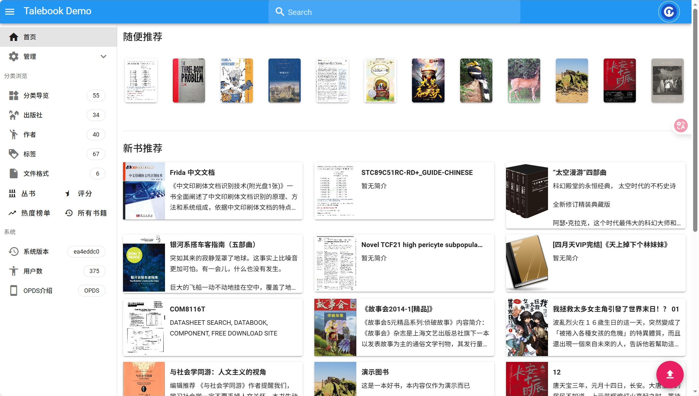

[](https://github.com/talebook/talebook/blob/master/LICENSE)
[]()
[](https://github.com/talebook/talebook/actions/workflows/ci.yml)
[](https://github.com/talebook/talebook/actions/workflows/build.yml)
[](https://hub.docker.com/r/talebook/talebook)


# Tale Book: My Calibre WebServer

A better online books library management website built on Calibre + Vue

## 简单好用的个人图书管理系统

**友情提醒：中国境内网站，个人是不允许进行在线出版的，维护公开的书籍网站是违法违规的行为！建议仅作为个人使用！**

这是一个基于Calibre的简单的个人图书管理系统，支持**在线阅读**。主要特点是：
* 美观的界面：由于Calibre自带的网页太丑太难用，于是基于Vue，独立编写了新的界面，支持PC访问和手机浏览；
* 支持多用户：为了网友们更方便使用，开发了多用户功能，支持~~豆瓣~~（已废弃）、QQ、微博、Github等社交网站的登录；
* 支持在线阅读：借助[epub.js](https://github.com/intity/epubreader-js) 库，支持了网页在线阅读电子书（章评功能开发中）；
* 支持批量扫描导入书籍；
* 支持邮件推送：可方便推送到Kindle；
* 支持OPDS：可使用[KyBooks](http://kybook-reader.com/)等APP方便地读书；
* 支持一键安装，网页版初始化配置，轻松启动网站；
* 优化大书库时文件存放路径，可以按字母分类、或者文件名保持中文；
* 支持快捷更新书籍信息：支持从百度百科、豆瓣搜索并导入书籍基础信息；
* 支持私人模式：需要输入访问码，才能进入网站，便于小圈子分享网站；

本项目曾用名：calibre-webserver


## Docker 

部署比较简单，建议采用docker，镜像地址：[dockerhub](https://hub.docker.com/r/talebook/talebook)

推荐使用`docker-compose`，下载仓库中的配置文件[docker-compose.yml](docker-compose.yml)，然后执行命令启动即可。
若希望修改挂载的目录或端口，请修改docker-compose.yml文件。

```
wget https://raw.githubusercontent.com/talebook/talebook/master/docker-compose.yml
docker-compose -f docker-compose.yml  up -d
```


如果使用原生docker，那么执行命令：

`docker run -d --name talebook -p <本机端口>:80 -v <本机data目录>:/data talebook/talebook`


例如

`docker run -d --name talebook -p 8080:80 -v /tmp/demo:/data talebook/talebook`


## 常见问题 

常见问题请参阅[使用指南](document/README.zh_CN.md)，无法解决的话，提个ISSUEE，[进Q群交流](https://qm.qq.com/q/5lSfpJGsBq)

手动安装请参考[开发者指南](document/Development.zh_CN.md)

NAS安装指南：请参考网友们的帖子：[帖子1](https://post.smzdm.com/p/a992p6e0/)，[帖子2](https://post.smzdm.com/p/a3d7ox0k/), [帖子3](https://odcn.top/2019/02/26/2734/)

**如果觉得本项目很棒，欢迎前往[爱发电](https://afdian.net/@talebook)，赞助作者，持续优化，为爱充电！**

**再次声明！本项目没有维护任何公开的书库站点，例如 joyeuse, wenyuange 等网站均属于网友搭建的，相关问题请不要咨询我，爱莫能助！**


## 贡献者
[](https://github.com/talebook/talebook/graphs/contributors)


## 演示

[Demo站点（密码 admin/demodemo ）](http://demo.talebook.org)

[视频简介（感谢@Pan06da的制作）](https://player.bilibili.com/player.html?aid=482258810&bvid=BV1AT411S7c3&cid=1018595245&page=1)


项目演示截图如下：

