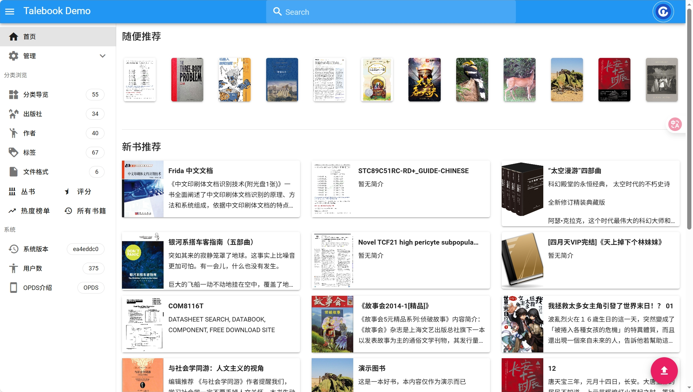

[](https://github.com/talebook/talebook/blob/master/LICENSE)
[]()
[](https://github.com/talebook/talebook/actions/workflows/ci.yml)
[](https://github.com/talebook/talebook/actions/workflows/build.yml)
[](https://hub.docker.com/r/talebook/talebook)


# Tale Book: My Calibre WebServer

中文 | [English](README_EN.md)

A better online books library management website built on Calibre + Vue

## 简单好用的个人图书管理系统

**友情提醒：中国境内网站，个人是不允许进行在线出版的，维护公开的书籍网站是违法违规的行为！建议仅作为个人使用！**

这是一个基于Calibre的简单的个人图书管理系统，支持**在线阅读**。主要特点是：
* 美观的界面：基于 Nuxt 4 + Vue 3 + Vuetify 全新编写的现代化界面，支持PC访问和手机浏览，支持中英文多语言、白天/夜间主题切换；
* 支持多用户：为了网友们更方便使用，开发了多用户功能，支持~~豆瓣~~（已废弃）、QQ、微博、Github等社交网站的登录；完善的用户管理、访客权限控制，密码采用 bcrypt 加密存储，支持图形验证码与极验人机验证；
* 支持在线阅读：内置 [candle-reader](https://github.com/talebook/candle-reader) 阅读器，网页在线阅读电子书，非EPUB格式自动转换；
* 支持网络书库：可导入 [Legado（开源阅读）](https://github.com/gedoor/legado)风格的书源，在线搜索、阅读网络小说，并可一键保存为 txt/epub 入库；提供书源管理界面，支持批量导入、启停、有效性体检；
* 支持批量扫描导入书籍，自动填充元数据，并提供回收站、批量删除等管理功能；
* 支持邮件推送：可管理多个 Kindle 等接收设备，一键推送，自动批量转换格式；
* 支持OPDS：可使用[KyBooks](http://kybook-reader.com/)等APP方便地读书；也支持从其它OPDS书库浏览并导入书籍；
* 支持一键安装，网页版初始化配置，轻松启动网站，并可在线检查版本更新；
* 优化大书库时文件存放路径，可以按字母分类、或者文件名保持中文；
* 支持快捷更新书籍信息：支持从百度百科、豆瓣、新华书店、番茄小说等多信息源并行搜索导入，还可接入 AI 大模型自动识别书籍信息；
* 支持私人模式：需要输入访问码，才能进入网站，便于小圈子分享网站；支持将单本书设为私藏，仅自己可见；

本项目曾用名：calibre-webserver

## 近一年更新亮点

* **网络书库与书源**：新增 Legado 风格书源解析引擎，可在线搜索、阅读网络小说并保存为 txt/epub 入库；配套书源管理界面（批量启停/删除、有效性体检、分页搜索）。
* **前端全面重写**：从 Nuxt 2 升级至 Nuxt 4 + Vue 3 + Vuetify 3，全站多语言国际化（中/英），新增白天/夜间主题切换，重做登录注册、书籍编辑等页面。
* **AI 与多源元数据**：新增 AI 大模型识别书籍信息接口；元数据信息源扩展至豆瓣、百度百科、新华书店、番茄小说、Calibre，多源并行查询。
* **在线阅读体验**：默认 EPUB 阅读器切换为自研 [candle-reader](https://github.com/talebook/candle-reader)；非 EPUB 书籍在线阅读时自动转换。
* **推送与转换**：新增用户设备管理，支持多设备推送；后台批量转换 Kindle 专有格式为 EPUB。
* **OPDS 导入**：支持添加外部 OPDS 源，浏览、批量导入书籍，含失败重试与进度查询。
* **安全加固**：用户密码从 SHA256 自动迁移至 bcrypt；登录/注册/找回密码支持图形验证码与极验 GeeTest；修复多处安全告警（ReDoS、代码注入等）。
* **管理后台增强**：新增用户管理界面、访客上传权限控制、回收站、批量删除图书、检查更新、用户反馈入口。
* **基础设施**：升级 Tornado 6.5，改用 uv 管理 Python 依赖，新增数据库迁移工具；Docker 基础镜像合并为 `talebook/talebook-base`，构建提速。


## Docker 

部署比较简单，建议采用docker，镜像地址：[dockerhub](https://hub.docker.com/r/talebook/talebook)

推荐使用`docker-compose`，下载仓库中的配置文件[docker-compose.yml](docker-compose.yml)，然后执行命令启动即可。
若希望修改挂载的目录或端口，请修改docker-compose.yml文件。

```
wget https://raw.githubusercontent.com/talebook/talebook/master/docker-compose.yml
docker-compose -f docker-compose.yml  up -d
```


如果使用原生docker，那么执行命令：

`docker run -d --name talebook -p <本机端口>:80 -v <本机data目录>:/data talebook/talebook`


例如

`docker run -d --name talebook -p 8080:80 -v /tmp/demo:/data talebook/talebook`


## 常见问题 

常见问题请参阅[使用指南](document/README.zh_CN.md)，无法解决的话，提个ISSUES，[进Q群交流](https://qm.qq.com/q/5lSfpJGsBq)

手动安装请参考[开发者指南](document/Development.zh_CN.md)（[English](document/Development.en_US.md)）

NAS安装指南：请参考网友们的帖子：[帖子1](https://post.smzdm.com/p/a992p6e0/)，[帖子2](https://post.smzdm.com/p/a3d7ox0k/), [帖子3](https://odcn.top/2019/02/26/2734/)

**如果觉得本项目很棒，欢迎前往[爱发电](https://afdian.com/@talebook)，赞助作者，持续优化，为爱充电！**

**再次声明！本项目没有维护任何公开的书库站点，例如 joyeuse, wenyuange 等网站均属于网友搭建的，相关问题请不要咨询我，爱莫能助！**


## 贡献者
[](https://github.com/talebook/talebook/graphs/contributors)


## 演示

[Demo站点（密码 admin/demodemo ）](http://demo.talebook.org)

[视频简介（感谢@Pan06da的制作）](https://player.bilibili.com/player.html?aid=482258810&bvid=BV1AT411S7c3&cid=1018595245&page=1)


项目演示截图如下：

