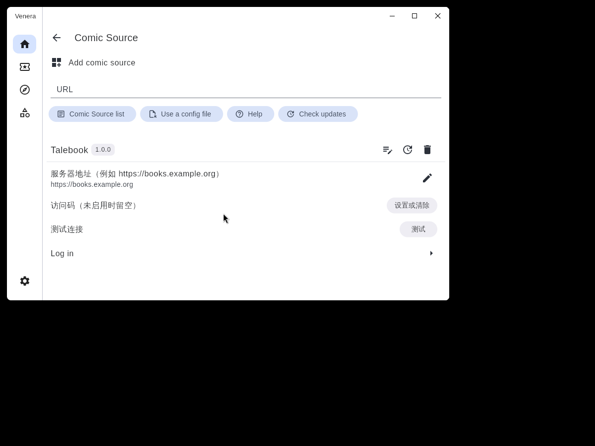
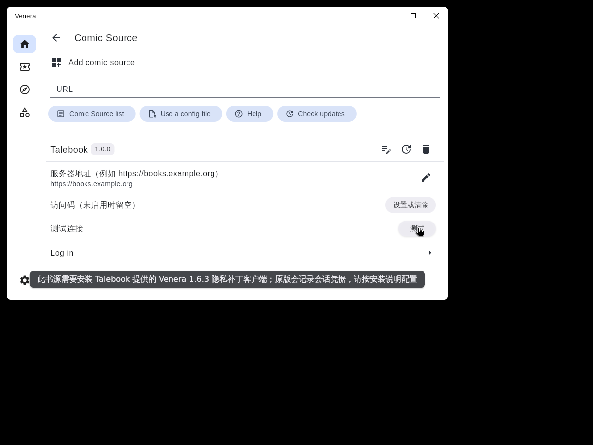

# 在 Venera 中连接 Talebook

此书源让 Venera 读取自己的 Talebook 漫画书库。每本 Talebook 书籍对应一本漫画和一个“完整漫画”章节，页面沿用服务端的自然顺序。

**当前交付是待客户端构建和真机 QA 的接入实现。原版 Venera 1.6.3 可以导入脚本，但不能使用本书源联网；需要下面的隐私补丁。没有完成补丁客户端安装验证，不应据此声明原版客户端可用。**

## 兼容范围

| 项目 | 要求 |
|---|---|
| Venera | 官方 `v1.6.3` / `1.6.3+163` 加本仓库的客户端隐私补丁；其他版本及分支未验证 |
| 客户端基线 | `venera-app/venera` 提交 `17a8cc1ec543530b0def3d92381e3f3955e6e66d` |
| Talebook | `v26.09.01` 及以上，并实际提供漫画分类、书籍详情 `files` 和 `contract_version=1` 的漫画接口；版本号不能替代接口检查 |
| 漫画格式 | 已分类为 `comic` 且包含 CBZ、图片 ZIP、CBR 或图片 RAR 的书籍 |
| 认证 | 原生用户名/密码登录，可配置访问码；不支持交互式验证码或仅第三方 OAuth 登录 |

普通电子书、未知分类、仅含 EPUB/PDF 的书籍均不展示，即使 EPUB 被识别为漫画。混合格式书籍只有在服务端分类为漫画且包含受支持容器时展示。CBR/RAR 的可读性还取决于服务器的归档解压工具和安全校验。

## 为何需要客户端补丁

核对官方 v1.6.3 源码发现，网络日志会记录登录响应中的 `Set-Cookie`，图片请求也会记录 Cookie。请求体的 `maskDataInLog` 不能保护这些会话凭据。页面签名 token 还可能进入图片缓存键和错误消息。

本仓库提供 `contrib/venera/venera-1.6.3-privacy.patch`：增加 `Network.sensitiveRequestsVersion=1` 能力，并让本书源的 API、封面和页面请求走不记录网络日志、不使用共享网络缓存、不跟随重定向的连接，保持 HTTPS 证书校验和 15 秒超时。书源不保留页面 token，图片使用同域的登录会话。

补丁还修复了官方漫画列表在空批次仍有游标时不继续加载的问题，并保留错误信息。

补丁的敏感通道直接连接服务器，**不使用 Venera 的自定义代理、DNS 覆盖、Cloudflare 绕过和忽略证书设置**；服务器必须能直接访问并具有有效证书。HTTP 地址适用于本机或自己控制的内网测试，远程连接请使用 HTTPS。

### 构建补丁客户端

这里提供源码补丁，未提供已构建的客户端安装包。由维护者或 QA 在官方构建环境中执行：

```bash
git clone https://github.com/venera-app/venera.git
cd venera
git checkout 17a8cc1ec543530b0def3d92381e3f3955e6e66d
git apply --check /path/to/talebook/contrib/venera/venera-1.6.3-privacy.patch
git apply /path/to/talebook/contrib/venera/venera-1.6.3-privacy.patch
# 按官方说明安装 Flutter 3.41.4 和 Rust，然后构建目标平台
flutter pub get
flutter build apk --release
```

本 PR 没有向 Venera 上游提交修改，也没有发布或签署客户端包。升级 Venera 时需重新核对补丁，不要手动伪造能力标记来绕过检查。

## 导入和配置书源

1. 在补丁客户端中打开 **漫画源 / Comic Source**，选择添加本地文件，导入 `contrib/venera/talebook.js` 。PR 合并前使用下载的文件或事项附件；默认更新地址只有合并后才会存在。
2. 在 Talebook 书源设置中填写服务器地址，如 `https://books.example.org` 。支持部署子路径，如 `https://books.example.org/books` ，不填写 `/api` ，不在地址中填账号密码、查询参数或片段。
3. 如果站点启用了访问码，选择 **访问码 → 设置或清除**。输入访问码；未启用时留空。此对话框的输入可见，提交后不会在设置列表显示访问码。
4. 使用书源的原生 **登录** 入口填写 Talebook 用户名和密码，再选择 **测试连接**。只有 `/api/user/info` 明确返回 `user.is_login=true` 才显示连接成功。
5. 在发现页打开 **Talebook 漫画** 或 **Talebook 最新漫画**；在搜索中选择 Talebook。打开漫画详情，进入 **完整漫画** 开始阅读。

用户名和密码由 Venera 原生账号存储保存，访问码保存于书源本地数据；这不是加密凭据保险库。不要分享包含账号数据的 Venera 导出或同步备份。更改服务器地址后必须主动重新登录，书源不会自动把已有密码发送到新地址。退出登录会删除本书源的会话和账号记录。

## 常见反馈与恢复

| 反馈 | 处理 |
|---|---|
| 需要隐私补丁客户端 | 安装上面构建的客户端；原版会在联网前拒绝，不会发送账号密码 |
| 无法连接 | 检查最终地址、端口、网络与有效 HTTPS 证书；补丁通道不使用客户端代理 |
| 请求被重定向 | 改填最终地址；不要依赖 HTTP 到 HTTPS 或域名重定向 |
| 用户名或密码错误 | 在原生登录入口重新输入自己的账号密码 |
| 需要访问码 / 访问码无效 | 在书源设置中填写站点正确的访问码后重新登录 |
| 启用了验证码 | 当前源无法完成交互式验证码；需要管理员提供允许该账号登录的站点配置 |
| 登录状态失效 | API 最多重新认证一次；仍失败时主动重新登录 |
| 图片读取失败 | 检查权限及网络；重新登录并重新打开漫画，刷新页面清单 |
| 漫画分类字段或接口不兼容 | 确认服务器已包含漫画相关改动，并重新扫描或分类书籍 |
| 无权阅读 / 账号未激活 / 容器损坏 | 检查服务端账号和书籍权限、激活状态或漫画文件 |

书源使用固定错误提示，不回显服务器的原始消息、文件路径、密码、Cookie 或 token。

## 已知限制

- 服务端列表没有漫画过滤参数，书源读取候选漫画的详情确认容器格式。每次最多处理 10 个原始页（通常 600 本书），最多返回 20 本漫画。游标按已消费的原始位置继续，稀疏书库的空批次仍保留下一批游标，补丁客户端继续加载至出现漫画或到达末尾；该客户端行为仍需构建和实际阅读复核。
- 不自动合并同一系列的多个卷册，不推测归档里的章节；每个容器书籍是一个完整章节。
- 阅读进度和收藏由 Venera 本地管理，不与 Talebook 网页阅读进度同步。
- 页面中途会话失效时需重新打开漫画；不对每张图片自动提交密码或无限重试。
- 大书库、动态新增或删除书籍时的列表一致性沿用 Talebook 的偏移分页限制。
- 客户端补丁只核对了固定版本的应用上下文；Flutter 编译、补丁客户端安装、真实 Talebook 登录和漫画翻页仍须 QA 完成。

## 复现验证与 QA 清单

书源测试使用 Node 内置测试框架，不需安装 npm 依赖：

```bash
node --test tests/venera/*.test.cjs
```

还可用固定版本的实际 API 库验证（应用补丁后）：

```bash
VENERA_INIT_JS=/path/to/venera/assets/init.js node --test tests/venera/*.test.cjs
python tests/venera/quickjs_smoke.py --api-init /path/to/venera/assets/init.js
```

QuickJS 命令需要 Talebook 已有的 `quickjs` Python 依赖，Node 测试使用 Node.js 20 及以上。Node HTTP 用例启动并关闭临时本机夹具服务器，验证表单认证、Cookie 会话、搜索、详情、恢复登录和图片字节。另提供真实 Talebook 后端用例，包含实际 Handler、Calibre 测试书库、账号密码验证与 CBZ 图片读取；两者都不代表补丁客户端真机验收。

在具有 Talebook 测试依赖的隔离容器内启动 `python -m tests.venera.real_server_fixture` ，只暴露本机临时端口，然后在另一终端运行：

```bash
TALEBOOK_TEST_SERVER=http://127.0.0.1:临时端口 VENERA_INIT_JS=/path/to/venera/assets/init.js node --test tests/venera/*.test.cjs
```

测试结束立即停止容器。夹具重置并修改 `tests/library` 的测试数据库和格式文件，禁止指向生产书库，也不要与其他后端测试并行。

子路径验证时，容器设置 `TALEBOOK_BASE_PATH=/books` ，反向代理移除请求的 `/books` 前缀后转发后端，测试地址填写代理的 `/books` 地址。页面清单已包含部署前缀时，书源不会重复添加；也兼容旧服务端返回的无前缀 API 路径。

QA 使用自己的测试账号和测试漫画，检查：

- 补丁客户端可构建并安装，脚本可从本地文件导入；原版联网前明确拒绝。
- 正确账号及访问码可以连接；错误密码、错误访问码、验证码、断网及会话失效反馈可理解。
- 含普通 EPUB/PDF、漫画 EPUB、CBZ/ZIP/CBR/RAR 及混合格式的书库，列表和搜索只展示符合筛选规则的书籍。
- 封面、完整漫画章节和 `1、2、10` 等自然顺序页面正确；稀疏批次、跨页、空漫画、损坏文件、未激活/无权限账号可恢复。
- 根路径和实际使用的子路径部署都能登录及读取封面和页面，Cookie 路径与反向代理配置一致。
- 使用专门的测试凭据检查客户端日志、错误文本和图片缓存键，没有测试密码、访问码、Cookie 或页面 token；不要将真实凭据的日志上传到 issue。
- Android、iOS 与 Linux/Windows 中实际使用的平台分别复核；本次没有宣称跨平台真机验证通过。

## 核对依据

- [官方 v1.6.3 书源规范](https://github.com/venera-app/venera/blob/v1.6.3/doc/comic_source.md)、[JavaScript API](https://github.com/venera-app/venera/blob/v1.6.3/assets/init.js)、[书源解析器](https://github.com/venera-app/venera/blob/v1.6.3/lib/foundation/comic_source/parser.dart)。
- [官方 v1.6.3 网络实现](https://github.com/venera-app/venera/blob/v1.6.3/lib/network/app_dio.dart)、[图片下载](https://github.com/venera-app/venera/blob/v1.6.3/lib/network/images.dart)、[构建说明](https://github.com/venera-app/venera/tree/v1.6.3)。
- [Talebook 漫画接口与识别 PR #1012](https://github.com/talebook/talebook/pull/1012) 已合并；现有接口见本仓库 `document/ComicReaderApi.zh_CN.md` 。
- [Mihon 初版 PR #1](https://github.com/hehetoshang/mihon-talebook-plugin/pull/1)、[user.is_login 兼容修复 PR #3](https://github.com/hehetoshang/mihon-talebook-plugin/pull/3) 均已合并；项目资源中的旧仓库名已更名。

书源脚本按 Talebook 仓库的 BSD-2-Clause 许可证提供；客户端补丁针对 GPL-3.0 的 Venera，只包含本次修改的 diff，不重新许可上游。

## 原版客户端安装检查截图

以下使用官方 1.6.3 Linux 发布包和隔离配置，验证脚本自动安装、设置渲染以及测试连接时的隐私能力拒绝；未用原版发送账号密码。




